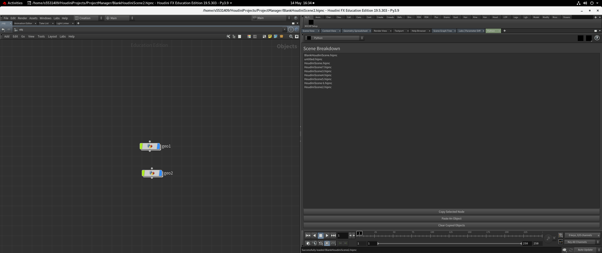

# Pipeline and TD Project 

## Introduction

The project manager scripts implement an alternate method to managing assets within a Houdini project. Instead of manually creating export rops within houdini, the user can simply copy any node tree as an fbx file, which then leaves no trace or clutter in the node view as the export rop then deletes itself. Then within the same UI, the user can navigate to a different scene and import and or all the previously copied/exported objects into the new scene. It is also possible to clear all objects that have been copied, which will clear the folder in which all the copied objects are. This allows for good clean-up once objects have been moved around and used all the unnecessary files can be deleted.  

## Functionality
Once the python script has been imported into Houdini, the user will be greeted by the UI. It is visually similar to the buttons and menus usually found in Houdini in order not to cause any visual confusion or uneasiness. Once the project has been set in the Houdini window (through menu file -> project), the UI should then display all the Houdini scenes in this project folder (Any file ending in .hipnc in this case).
    
By clicking on the project title, the scene will open. With an object node selected, the user can then press copy to create an .fbx file in the Copied Objects folder in the project directory. In the same file, or using navigating to a different scene, pressing paste will open a menu showing all the files in the Copied Objects folder, which can then be selected to paste the chosen .fbx object into the current scene. 
    
Once done, the user can clear the Copied Objects folder of all the copied objects.  

## Required Packages/Modules
    As long as the user has Python and Houdini, no other packages should be required.

## Deployment
1. If a scripts/python directory doesn't exist in the Houdinixx.x (i.e. Houdini19.5) folder, create a Houdinixx.x/scripts/python folder.
2. Download the project folder and copy it into the scripts/python folder 
3. In Houdini, make a python panel.

4. Define the project directory by choosing File > Project.
5. Click New Interface as show below. Copy the following snippet of code into the script editor to run the Project Manager tool. It's also commented in the __init__.py file for reference. 
    
    import importlib  
    from projectmanager import project  
    importlib.reload(project)  

    def onCreateInterface():  
        return project.ProjectManager()
    

6. Give it a new name and label or else it will default to "New Python Interface". Hit accept, choose the correct python script from the drop-down menu and the Project Manager UI will appear. 

## Testing
The program was tested using unittests for each function. By creating a copy of the project.py file called testproject.py, the tool could be tested within Houdini, as shown below, mocking certain aspects of QT to replicate button pressed etc. Unfortunately there was an issue with the clear button test, but this was tested manually. Otherwise, all aspects aside from the QT visual design were tested. 
    

## References
MIX Training (2017) VMT 023 - HOUDINI - Python Project Manager Series Chapter 01. Available at: https://www.youtube.com/watch?v=jL7jM1bJhxE.
